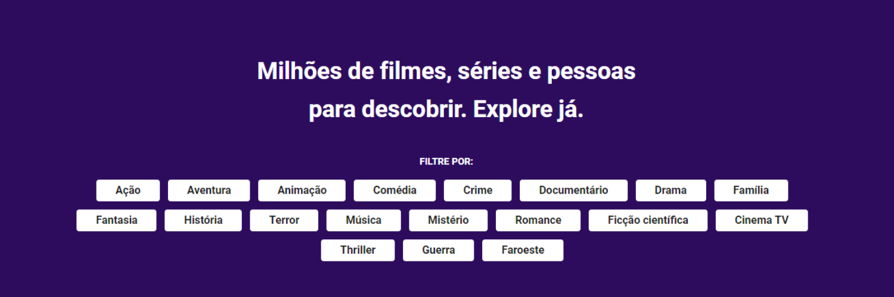

# React Movie App

https://img.shields.io/github/languages/count/giuliatondin/movie-app?color=%23ffd103&style=for-the-badge
https://img.shields.io/github/languages/top/giuliatondin/movie-app?color=%23ffd103&style=for-the-badge
https://img.shields.io/github/repo-size/giuliatondin/movie-app?color=%23ffd103&style=for-the-badge
https://img.shields.io/github/license/giuliatondin/movie-app?color=%23ffd103&style=for-the-badge
https://img.shields.io/github/last-commit/giuliatondin/movie-app?color=%23ffd103&style=for-the-badge

> A movie aplication consuming The Movie Database (TMDB) API with React. The app presents the movie trends and details of the movies.

## 🚀 Code and tools
The following tools were used to build this project:

* [React](https://reactjs.org);
* [JavaScript](https://developer.mozilla.org/docs/Web/JavaScript);
* [SCSS](https://sass-lang.com);
* [Material-UI](http://mui.com/).

## 💻 Requirements
Before start, make sure you've met the following requirements:
* You have Node.js installed;
* You have NPM or YARN installed;
* You have a code editor installed (e.g. Visual Studio Code).

## ☕ Running the application
After installing the requirements, follow these steps to run the application on your computer:

* Open the project folder on cmd;
* Run `npm start`.

You can make the desired changes in the application and view them in the browser localhost. 

## Features
The application has the following features:
- [x] Presents on the homepage the currently most popular movies;
- [x] Presents the details of the movies, such as the cast, synopsis, trailer etc, in inner page;

In an upcoming update, it would be interesting to add:
- [ ] Search page;

### Author
<a href="https://github.com/giuliatondin">Made with ❤️ by Giulia Tondin 👋🏽 Get in touch!</a>